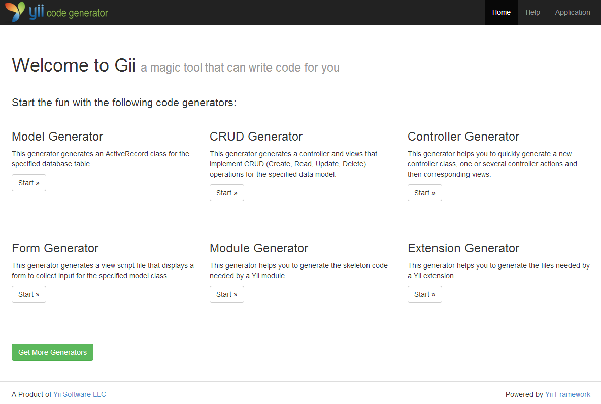
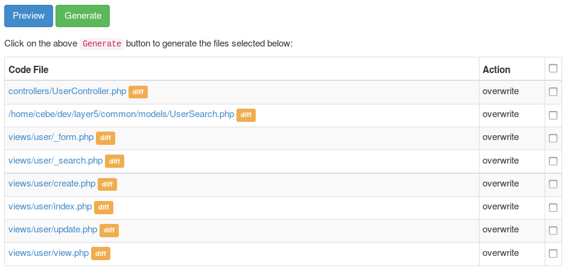

Основи використання
===================

Коли ви відкриваєте Gii, спершу ви бачите початкову сторінку, яка дозволяє вам обрати генератор.

За замовчуванням доступні перелічені генератори:

- **Model Generator** (**Генератор моделі**) - Цей генератор генерує клас ActiveRecord для вказаної таблиці бази даних.
- **CRUD Generator** (**Генератор CRUD**) - Цей генератор генерує контролер і представлення, які реалізовують функціонал операцій CRUD (Create, Read, Update, Delete)
  для вказаної моделі даних.
- **Controller Generator** (**Генератор контролера**) - Цей генератор допоможе вам швидко згенерувати новий клас контролера, одну або декілька
  дій контролера та їх відповідні представлення.
- **Form Generator** (**Генератор форми**) - Цей генератор генерує файл скрипту представлення, що відображає форму введення інформації
  для вказаного класу моделі.
- **Module Generator** (**Генератор модуля**) - Цей генератор допоможе вам згенерувати каркас коду, необхідний для модуля Yii.
- **Extension Generator** (**Генератор розширення**) - Цей генератор допоможе вам згенерувати файли, необхідні для розширення Yii.

Після вибору генератора натисканням кнопки "Start" ви побачите форму, яка дозволяє вам сконфігурувати
параметри генератора. Заповніть форму відповідно до ваших потреб і натисніть кнопку "Preview" для
перегляду коду, який Gii збирається згенерувати. В залежності від того, який генератор ви обрали та чи файли
вже існують чи ні, ви отримаєте вивід подібний до того, що зображено на наступному зображенні:

Натиснувши на імені файлу, ви можете попередньо переглянути код, який буде згенеровано для цього файлу.
Коли файл вже існує, Gii також забезпечує перегляд відмінностей (diff), який показує відмінності між наявним кодом
та тим, що буде згенеровано. У цьому випадку ви також можете обирати які файли повинні бути перезаписані, а які ні.

> Підказка: Коли використовуєте генератор моделі для оновлення моделей після змін у базі даних, ви можете скопіювати код із попереднього перегляду Gii
  та поєднати зміни з вашим власним кодом. Ви можете використовувати функціонал Інтегрованого Середовища Розробки (IDE), як наприклад,
  [порівняння з буфером обміну в PHPStorms](http://www.jetbrains.com/phpstorm/webhelp/comparing-files.html).
  [Aptana Studio](http://www.aptana.com/products/studio3/download) або редактори на базі [Eclipse](http://www.eclipse.org/pdt/) також дозволяють [порівняння з буфером обміну](http://andrei.gmxhome.de/anyedit/examples.html) при використанні [плагіну інструментів AnyEdit](http://andrei.gmxhome.de/anyedit/) для цього, який дозволяє вам приєднувати актуальні зміни, не враховуючи те, що повторює ваш власний код.
  

Після того, як ви оглянули код та обрали файли для генерування, ви можете натиснути на кнопку "Generate" для створення
файлів. Якщо все пройшло нормально - справу зроблено. Якщо ви бачите помилки про те, що Gii не має можливості згенерувати файли, необхідно
налаштувати права доступу до директорії, щоб ваш веб-сервер мав право на запис до директорій та міг створювати файли.

> Примітка: Код згенерований за допомогою Gii - це лише шаблон, який необхідно допрацювати для ваших потреб. Призначення генератора -
  допомогти вам швидко створювати нові речі, але це не те, що створює готовий до використання код.
  Багато хто використовує моделі згенеровані за допомогою Gii без змін та лише розширюють їх для часткового
  налаштування. Це не той спосіб, в який потрібно використовувати генератор. Код згенерований за допомогою Gii може бути неповним або неправильним
  та повинен бути зміненим для відповідності вашим потребам перед його використанням.
  
